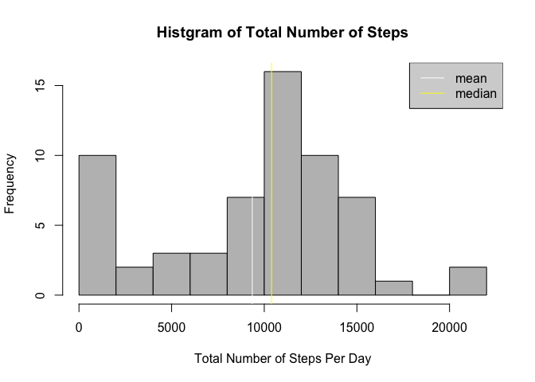
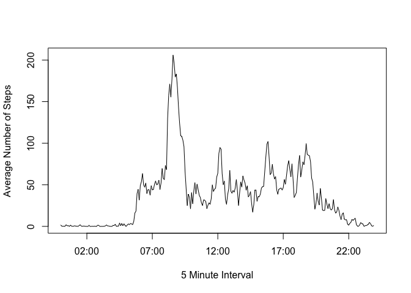
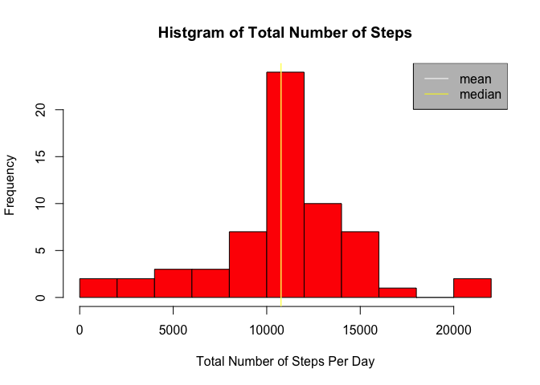
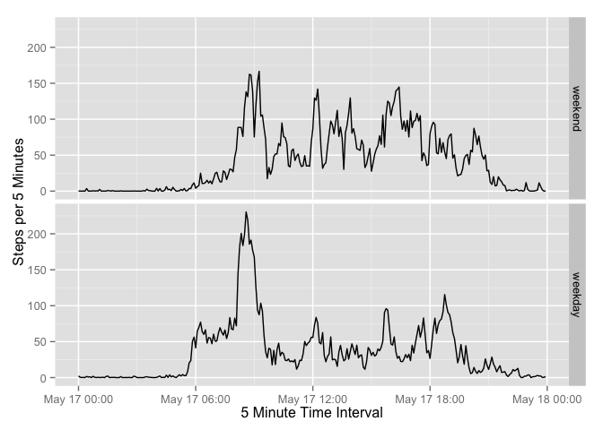

# Reproducible Research: Peer Assessment 1


## Loading and preprocessing the data
### Loading from the cloned repo
From forking the RepData_PeerAssessment1 repo and cloning locally
a file called 'activity.zip should exist. We are going to unzip
it to a temporary directory and read into R.


```r
if ( file.exists("activity.zip")) {
    td <- tempdir()
    tf <- tempfile(tmpdir=td, fileext=".csv")
    fname <- unzip("activity.zip",list=TRUE)$Name
    unzip("activity.zip", files=fname, exdir=td, overwrite=TRUE)
    fpath = file.path(td, fname)
    activityData <- read.csv(fpath[1], stringsAsFactors=FALSE)
}   
```
### Preprocess data to add a new POSIXlt date and time field
We create a new value variable based on the date and interval fields.
If we change interval from integer to character and manipulate to represent a time string. Then concatenate this field with the date field
to form a date and time string. Then use strptime to conver to POSIXlt
The string manipulation is performed by function 'convertIntervaToChar.
We apply this function and create a timeInterval value from the activityData.
We then set the date column  to be a Date


```r
## Convert interval into time and marry with date
convertIntervalToChar <- function(x){
    result <- as.character()
    if (x > -1 & x < 100){
        result <- paste0("0:",as.character(x))
    } else if(x > 55 & x < 1000){
        
        x.as.char <- as.character(x)
        result <- paste0(substr(x.as.char,1,1),":", 
                         substr(x.as.char,2,3))

        
    } else if (x > 955 & x < 2400 ){
        x.as.char <- as.character(x)
        result <- paste0(substr(x.as.char,1,2),":", 
                         substr(x.as.char,3,4))
        
    } else{
        print(x)
        stop("Data has an unknown value for conversion")
    }
    return(result)
}

intervalCharTime <- lapply(activityData$interval, convertIntervalToChar)

timeInterval <- strptime(paste0(activityData$date, " ",
                                          intervalCharTime),
                                   "%Y-%m-%d %H:%M", "GMT")

activityData$date <- as.Date(activityData$date,"%Y-%m-%d", "GMT")
```


## What is mean total number of steps taken per day?

To create a Histogram we 
Calculate the total number of steps taken per day

Calculate and report the mean and median of the total number of steps taken per day

```r
library(dplyr)
```

```
## 
## Attaching package: 'dplyr'
## 
## The following object is masked from 'package:stats':
## 
##     filter
## 
## The following objects are masked from 'package:base':
## 
##     intersect, setdiff, setequal, union
```

```r
dailyActivity <- group_by(activityData,
                          cut(activityData$date,"1 day"))


summary <- summarise(dailyActivity, sum(steps,na.rm=TRUE))
activityMean <- mean(summary$sum)
activityMedian <- median(summary$sum)

hist(summary$sum, breaks=15, col="grey", 
     xlab="Total Number of Steps Per Day",
     main = "Histgram of Total Number of Steps" )
legend("topright", legend=c("mean", "median"), 
       col=c("white","yellow"),lty=c(1,1), bg="light grey")
abline(v=activityMean, col="white")
abline(v=activityMedian, col="yellow")
```

 

```r
cat("The mean of the total activities is ", activityMean, "\n")
```

```
## The mean of the total activities is  9354.23
```

```r
cat ("The median of the total activities is ", activityMedian, "\n")
```

```
## The median of the total activities is  10395
```

These are shown on the Histogram

## What is the average daily activity pattern?

We create  time series plot (i.e. type = "l") of the 5-minute interval (x-axis) and the average number of steps taken, averaged across all days (y-axis)


```r
activityData$sample.interval <- strftime(timeInterval, "%H:%M")
groupByInterval <- group_by(activityData, sample.interval)
intervalAverage <- summarise(groupByInterval, mean(steps,na.rm=TRUE))

p<- plot(strptime(intervalAverage$sample.interval,"%H:%M","GMT"),
     intervalAverage$mean, type="l", xlab="5 Minute Interval",
     ylab="Average Number of Steps")
```

 
We find which 5-minute interval, on average across all the days in the dataset, contains the maximum number of steps


```r
maxStepPeriod <- intervalAverage$sample.interval[intervalAverage$mean == max(intervalAverage$mean)]
cat("The period of maximum step time is ",maxStepPeriod, "\n")
```

```
## The period of maximum step time is  08:35
```


## Imputing missing values
We note that there are a number of days/intervals where there are missing values (coded as NA). The presence of missing days may introduce bias into some calculations or summaries of the data.

We alculate and report the total number of missing values in the dataset (i.e. the total number of rows with NAs)


```r
naRows <- activityData[is.na(activityData$steps),]
numberNAs <- nrow(naRows)
cat("The Total number of NA's is ", numberNAs, "\n")
```

```
## The Total number of NA's is  2304
```

We devise a strategy for filling in all of the missing values in the dataset using the mean for the 5-minute interval.
And create a new dataset that is equal to the original dataset but with the missing data filled in.


```r
## copy original date to new data frame
filledActivityData <- activityData
## populate the missing data based on the mean steps per interval 
for ( i in 1:nrow(filledActivityData)) {
    if (is.na(filledActivityData$steps[i]))
    filledActivityData$steps[i] <- intervalAverage$mean[intervalAverage$sample.interval == activityData$sample.interval[i]]
}    
```

We make a histogram of the total number of steps taken each day and calculate and report the mean and median total number of steps taken per day of the filled in data


```r
## split on day
dailyActivity <- group_by(filledActivityData,
                          cut(filledActivityData$date,"1 day"))

summary <- summarise(dailyActivity, sum(steps,na.rm=TRUE))
filledActivityMean <- mean(summary$sum)
filledActivityMedian <- median(summary$sum)

hist(summary$sum, breaks=15, col="red",
          xlab="Total Number of Steps Per Day",
     main = "Histgram of Total Number of Steps" )
legend("topright", legend=c("mean", "median"), 
       col=c("white","yellow"),lty=c(1,1), bg="grey")
abline(v=filledActivityMean, col="white")
abline(v=filledActivityMedian, col="yellow")
```

 

Do these values differ from the estimates from the first part of the assignment? What is the impact of imputing missing data on the estimates of the total daily number of steps?

```r
cat("The mean of the total activities with missing data is ",
    activityMean, "\n")
```

```
## The mean of the total activities with missing data is  9354.23
```

```r
cat ("The median of the total activities with missing data is ", activityMedian, "\n")
```

```
## The median of the total activities with missing data is  10395
```

```r
cat("The mean of the total activities with filled in data is ", filledActivityMean, "\n")
```

```
## The mean of the total activities with filled in data is  10766.19
```

```r
cat ("The median of the total activities with filled in data is ", filledActivityMedian, "\n")
```

```
## The median of the total activities with filled in data is  10766.19
```
### A Conclusion of Mean and Median Data For Missing and Filled Values
We conclude that the Mean and Median have become the same value of 10766.19 in the filled data histogram and that in addition the overall frequencies have fallen. The overall shape is very similar except that for lower daily step numbers ( below 3000) has dropped dramatically. 

## Are there differences in activity patterns between weekdays and weekends?

Using the filled in data we  create a new factor variable in the dataset with two levels – “weekday” and “weekend” indicating whether a given date is a weekday or weekend day.
We then create a panel plot to high light wether there is any difference.


```r
library(ggplot2)
filledActivityData$days <- factor(timeInterval$wday %in% 1:5,
               labels=c("weekend","weekday"))

nn <- aggregate(filledActivityData$steps, 
                by=list(filledActivityData$sample.interval, 
                        filledActivityData$days),FUN="mean")


g <- ggplot(nn, aes(x = strptime(Group.1, "%H:%M","GMT"), y=x)) + 
    geom_line() + xlab("5 Minute Time Interval") + 
    ylab("Steps per 5 Minutes") +
    facet_grid(Group.2 ~ .)
g
```

 

### A Conclusion for Weekday and Weekend Activity
There appears to be differences in the two plots. For weekend days the start of activity is slightly later and the number of steps increases moderately during the day as opposed to weekday days where the start is slightly earlier with a more pronounced intensity which trails off slightly during the rest of the day.
